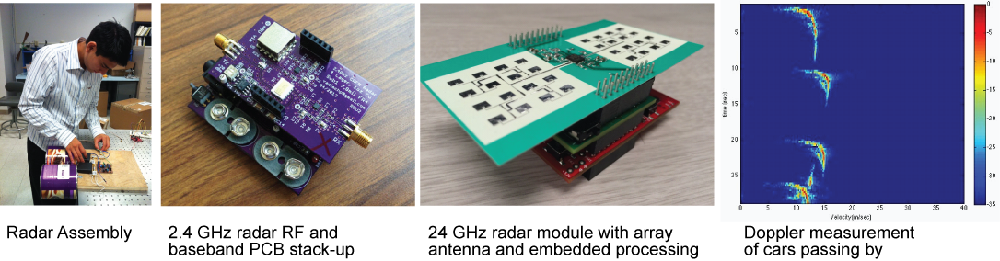

EEC 134 Design of High Frequency Systems
======

The EEC 134 course was created to satisfy the need for a senior project course for students who are interested in high freqeuency electronic systems. The two-quarter long course emphasizes on system level design concepts and strives to provide a hands-on experience. As the course evolves, the projects start to encompass many facets of electrical engineering, including system engineering, antenna design, analog circuit design, embedded systems, and digital signal processing. 

The first project option we have implemented is a frequency modulated continuous wave (FMCW) radar system that can perform range, Doppler, and synthetic aperture radar (SAR) measurements. In the first quarter, the students build an FMCW radar system using breadboard and off-the-shelf connectorized RF components. In the second quarter the students focus on improving the system performance and gauge their success by a performance competition. In the future, other project options, such as software-defined radio (SDR), RFID systems, wireless sensors networks, and RF/microwave biomedical systems, will be explored.

<strong>Watch a live demo at the 2015 Bay Area Maker Faire:</strong> 

 

----
This Github repo is used to distribute the EEC 134 lecture notes, lab manuals, and supplementary materials such as computer codes with registered EEC 134 students as well as anyone who is interested in the course materials. The public nature of this git repo means that that anyone can contribute to the development of the course materials. Simply create a [pull request](https://help.github.com/articles/using-pull-requests/)

----
Roadmap:
- Lab 1 Baseband circuits
 - add an ADC lab (far future)
 - bring back the function generator
- Lab 2 Amplifier:
 - design a lab for measuring the noise figure
- Lab 3 Oscillator:
 - add a lab on measuring phase noise after we buy new spectrum analyzers
 - add a lab on building a PLL
 - design a lab to demonstrate locking bewteen oscillators. Perhpas with two oscillators and a coupler? 
- Lab 4 Mixer：add modulation to this lab
 - design a lab to demonstrate IQ modulation & demodulation; use an attenuator to show the effect of IQ amplitude imbalance
- Lab 6 convert to a radar only lab 
- Lab 7 (new)

